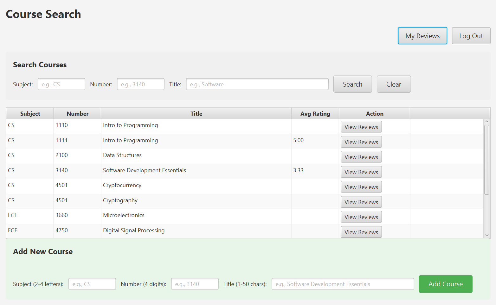

# Course Review Application

A JavaFX-based CRUD desktop application that allows users to create accounts, search for university courses, and submit anonymous course reviews. The application follows an MVC-style architecture and uses JDBC with a SQLite database for persistent storage. Users can add courses, write and edit reviews, view aggregated course ratings, and manage their own reviews through a clean, multi-scene GUI.

This project was developed as a capstone assignment for a Software Development Essentials course and is provided here as a public source-code mirror for portfolio and code review purposes.

## Tech Stack

- Language: Java (JDK 21)
- GUI Framework: JavaFX 21
- Build Tool: Gradle
- Database: SQLite
- Database Access: JDBC
- Architecture: MVC (Model–View–Controller)

## Features

- User authentication with input validation  
- Course creation with duplicate prevention  
- Flexible course search by subject, number, or title  
- Anonymous course reviews with ratings (1–5) and optional comments  
- Aggregated average ratings per course  
- Review editing and deletion with timestamped updates  
- Persistent storage across application sessions  

---
## Screenshots

  
  

  
  

## Authors
1) Matthew Batmunkh, abf9yu, [Mbatmu6084]
2) Titus Lee, hvm4sg, [titushyunkyu]
3) Rick Escudero, xqe2yj, [rickescudero]
4) Nathan Nguyen, xmv6rg, [nathannguyen13]

## To Run

This application is a JavaFX GUI application built using JavaFX 21.0.9 and JDK 21.0.9.
Run with Gradle: ./gradlew run

Note: The SQLite database file is not included in this repository. The database is automatically created at runtime if it does not exist.

## Contributions

List the primary contributions of each author. It is recommended to update this with your contributions after each coding session.:

### [Author 1 - Matthew Batmunkh]

* Implemented the my reviews scene, displaying all reviews written by the logged in user
* Integrated my reviews with databse to retrieve user specific reviews
* Implemented navigation from my reviews to individual courses
* Tested functionality

### [Author 2 - Titus Lee]

* Implemented course reviews scene.
* Fixed minor errors throughout the whole app.

### [Rick Escudero]

* Started project and implemented databases
* Created UserLogin Scene and refactored some of the changes associated

### [Author 4 - Nathan Nguyen]

* Implemented Course Search Scene
* Tested and verified all add course validation, duplicate prevention logic, search functionality, course display with ratings, and navigation buttons 
## Issues

None at the time of submission

